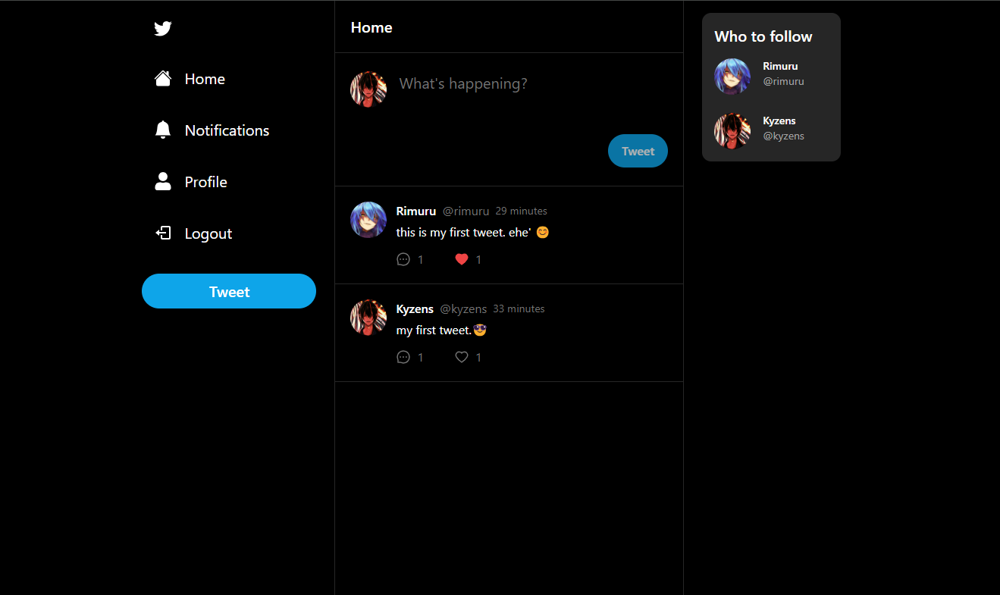

# Twitter App with Minimal Version - NEXT JS, Prisma & MongoDB



### Prerequisites

**Node version 16.x**

### Cloning the repository

```shell
git clone https://github.com/wayosu/twitter-lite-app.git
```

### Install packages

```shell
npm i
```

### Setup .env file

```js
DATABASE_URL=
NEXTAUTH_JWT_SECRET=
NEXTAUTH_SECRET=
```

### Start the app

```shell
npm run dev
```

## Available commands

Running commands with npm `npm run [command]`

| command | description                              |
| :------ | :--------------------------------------- |
| `dev`   | Starts a development instance of the app |
